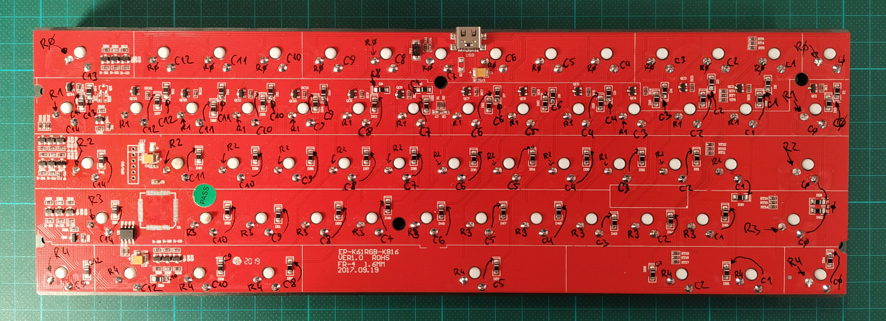

# ha_ck61

This is for a Motospeed CK61 stripped of it's original controller and rewired to a BluePill (generic Chinese STM32F103C8T6).

The software is based on the handwired/bluepill from [FPazos](https://github.com/fpazos), which in turn is based on the [KC64 of Xydane](https://github.com/Xydane/qmk_firmware).

Keyboard Maintainer: [chbw](https://github.com/chbw)
Hardware Supported: Motospeed CK61 wired to Bluepill STM32F103C8T6
Hardware Availability: Everywhere

Make example for this keyboard (after setting up your build environment):

    make handwired/ha_ck61:default

See the [build environment setup](https://docs.qmk.fm/#/getting_started_build_tools) and the [make instructions](https://docs.qmk.fm/#/getting_started_make_guide) for more information. Brand new to QMK? Start with our [Complete Newbs Guide](https://docs.qmk.fm/#/newbs).

Read everything before using it.

## Introduction

First of all thanks to [FPazos](https://github.com/fpazos) and [Xydane](https://github.com/Xydane) at [GeekHack](https://geekhack.org/) for their bluepill firmware, without them you couldn't be reading this.

## Resistor fix

If you want to use the Bluepill USB port, it's very likely that you need to solder a 1.8 kΩ between PA12 and 3.3V. That depends on the PC's motherboard but I needed, more info [here](https://wiki.stm32duino.com/index.php?title=Blue_Pill).

## No bootloader

Neither FPazos, Xydane nor I used the bootloader. I just used a cheap ST-LINK compatible programmer.

## Wiring

### Bluepill Port Pins

For easy routing, the following pin assignments were made:

| Row | Pin |
| :-- | :-- |
| R0  | PB9 |
| R1  | PB8 |
| R2  | PB7 |
| R3  | PB6 |
| R4  | PB5 |

| Column | Pin  |
| :----- | :--- |
| C0     | PA10 |
| C1     | PA9  |
| C2     | PA8  |
| C3     | PB15 |
| C4     | PB14 |
| C5     | PB13 |
| C6     | PB12 |
| C7     | PA7  |
| C8     | PA6  |
| C9     | PA5  |
| C10    | PA4  |
| C11    | PA3  |
| C12    | PA2  |
| C13    | PA1  |
| C14    | PA0  |

Actually, there is no C13 in use. The single key I thought to be on a separate column has been integrated to C14 with a very short piece of wire. Also, be aware that the lower right "FN"-Key has a rather surprising location in the matrix.

There are a lot of pins on the bluepill's pin header. However, some of the GPIOs serve an important (or unchangeable) main function and can not be used for the keyboard matrix easily (if at all).

| Pin    | usable for matrix | note                           |
| :----- | :---------------: | :----------------------------- |
| GND    | no                | power                          |
| GND    | no                | power                          |
| VCC3V3 | no                | power                          |
| NRST   | no                | reset                          |
| PB11   | yes               | I2C2_SDA                       |
| PB10   | yes               | I2C2_SCL                       |
| PB1    | yes               |                                |
| PB0    | yes               |                                |
| PA7    | yes               |                                |
| PA6    | yes               |                                |
| PA5    | yes               |                                |
| PA4    | yes               |                                |
| PA3    | yes               |                                |
| PA2    | yes               |                                |
| PA1    | yes               |                                |
| PA0    | yes               | wkup                           |
| PC15   | no                | 32.768kHz Osc                  |
| PC14   | no                | 32.768kHz Osc                  |
| PC13   | no                | onboard LED (used as CAPS LED) |
| VBAT   | no                | power                          |

| Pin    | usable for matrix | note                                 |
| :----- | :---------------: | :----------------------------------- |
| PB12   | yes               |                                      |
| PB13   | yes               |                                      |
| PB14   | yes               |                                      |
| PB15   | yes               |                                      |
| PA8    | yes               | MCO                                  |
| PA9    | yes               | usart1_tx                            |
| PA10   | yes               | usart1_rx                            |
| PA11   | no                | USBDM                                |
| PA12   | no                | USBDP                                |
| PA15   | ~                 | JTDI (can be remappepd after reset)  |
| PB3    | ~                 | JTDO (can be remapped after reset)   |
| PB4    | ~                 | JNTRST (can be remapped after reset) |
| PB5    | yes               |                                      |
| PB6    | yes               | I2C1_SCL                             |
| PB7    | yes               | I2C1_SDA                             |
| PB8    | yes               |                                      |
| PB9    | yes               |                                      |
| 5V     | no                | power                                |
| GND    | no                | power                                |
| VCC3V3 | no                | power                                |
